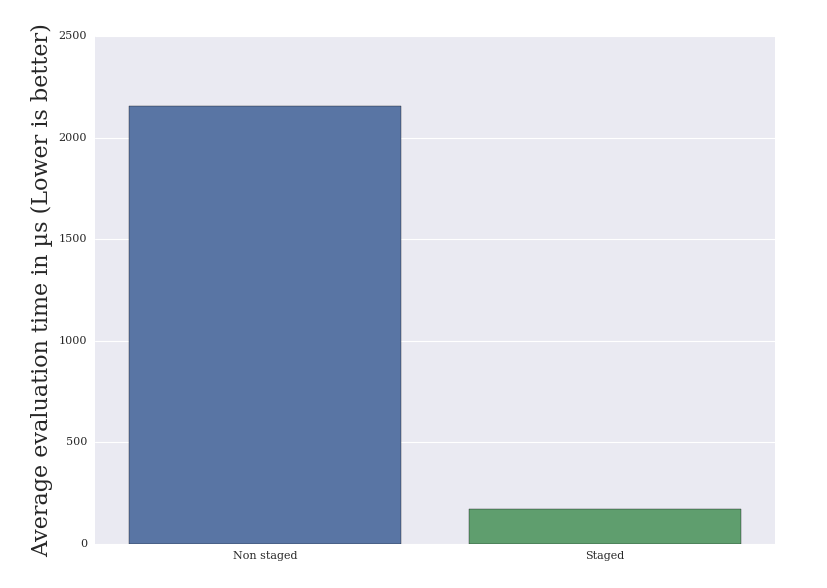
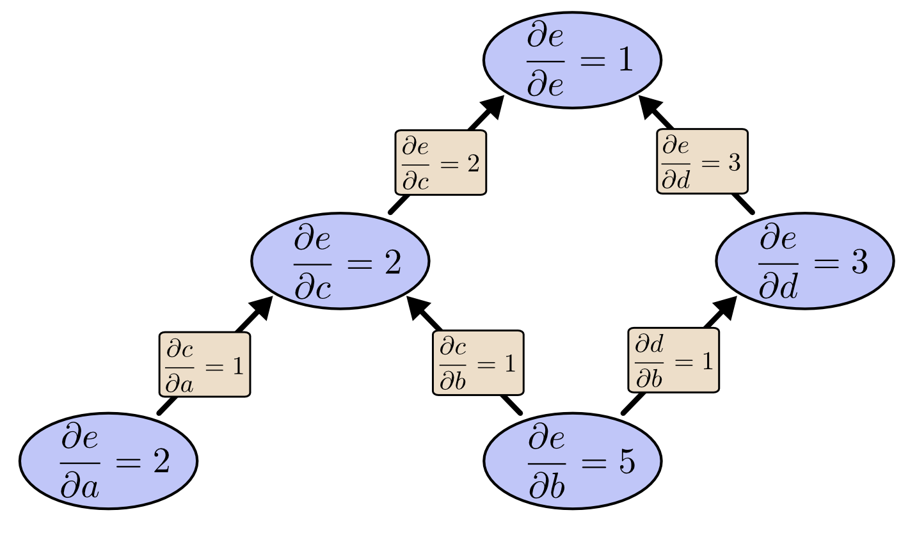

# Introduction {-}

If programming is an art, then programming languages are the artitst's brush. The tools are chosen according to individual preferences, but with memory, scaling and performance constraints in mind. One of those major constraints is efficiency. Efficiency is less crucial nowadays than it was back when computing power was expensive and scarce, but it is still a very desirable goal. Efficiency can be achieved by writing explicitly and very precisely each step of the program. To enable this, some programming languages are relatively close from the model of the hardware. Those programming languages are called "low-level", because close from the machine and thus distant from the heights of abstraction. But as programs grow more complex, the need for abstraction does too. 

To raise abstraction power, expressive languages with complex compilers were made. Ironically, the first programming language, lambda-calculus, was the epitome of abstraction and thought of before the first very computer to execute it. Those languages, mostly from the functional programming world, help the user to express the intent rather than the steps, the "what" rather than the "how". The compilers needed for them are heavy machineries that applies all sorts of optimizations before translating source code to machine language. The more abstract the language, the more gap there is to fill, and the more compilers have opportunity to optimize. 

Hence, in an ideal world, we can achieve **abstraction without regret**, writing very abstract programs compiled with optimal efficiency for any platform and any hardware. Unfortunately, we are not there yet, and expert implementers are still very much in need. So, should we just throw all our efforts into writing the ultimate compiler for the ultimate language ?

Growing complexity in compiler is not the panacea. In a wide range of programs, compilers are limited by the lack of domain-specific knowledge. Indeed, constraining a program to one specific domain opens the door for a wide range of specific optimizations. Furthermore, code generation by "macro" is a common but rather poor way to enable the full extent of abstraction power brought by code generation.

One solution to both issue could be to extend the compiler for each domain and having a very developped macro system. The other one, is to write specific domain-specific language in a staged environment. To avoid reinventing the wheel, embedded DSL is a nice compromise between specialized and general-purpose languages. It is this embedded DSL staged meta-programming path that is explored with LMS, a Scala library for runtime code generation. In the first part, we will study LMS and its related concepts. Then in the second part, we will cover the new frontend implementation that offers a new user frontend, more convenient for the end-user and with multiple benefits enabled by extended typeclass usage. We also cover a case study of LMS applied to the domain of computation graphs.

# LMS

Lightweight Modular Staging (LMS) is a Scala framework for runtime code generation. It has two main overlapping uses:

* As a meta-programming framework for writing staging compilers. A staging compiler can generate object programs from user meta-programs written in a subset of Scala with staging annotations enriched with DSL. An example of such meta-programs can be staged interpreters. As we will see later, staged interpreters are compilers themselves.
* As a Transpiler framework for writing optimised transpilers from programs written in a subset of Scala enriched with DSL. We will see that this case applies when the user programs are intended to use lifted types in lieu of common types. 

By "transpiler", we mean that compared to a compiler, the generated output is a valid source code in a given programming language. It is optimized in the sense that the written transpiler does not only translate code from one language to another but will also be capable to applies some transformation to the internal representation of the user program before generating the output. Among those transformations, we can apply the usual compiler optimisations. We can also apply some more domain-specific transformations if needed. This enable to use Scala as an abstract unified source language to generate programs that use as intermediary step various other languages and target heterogenous hardware. This is the case of the framework Delite, written on top of LMS.

Meta-programming is the art of writing computer programs that can handle other programs as data. Thus, they are able to reason about programs, which they are themselves, hence the name. In staged meta-programming, the goal is to generate new programs from annotated programs. Those annotations are called staged annotations. The program source is called the **meta-program**. The program being generated is the the **object program**. The generation can go through multiple stage. Each stage is another transformation that can leverage new informations to build the next program. LMS is heterogeneous: the meta-program and the object program can be written in different programming languages (e.g: generating C with formal proofs annotations as in lms-verify). 

## Why staging

To see the benefits of a staged meta-program, we will start by an example where its benefits shine clearly: sparse vector multiplication. 

Assume that v1 and v2 are sparse vector of size N with K cells containing Integers: `N >> K`.

~~~scala
val v1: IndexedSeq[Int]
val v2: IndexedSeq[Int]
v1.zip(v2) map { case (x1, x2) => x1 * x2 } sum
~~~

This works but it is terribly inefficient. What about all those 0-multiplications. Surely, we can something better. There is 3 cases:

1. v1 and v2 are both known at compile time
2. v1 is known at compile time
3. v1 and v2 are both only known at runtime

In the two first case, staged meta-programming is able to generate efficient code that avoid the (`N [zip] + N [*]`) operations at runtime and reduce it to `K` operations (no more zip) and even 0 operations in the first case!

How ? Well it is all about available information. We will start with the first case which is the simplest to understand:
We know at staging time all the data and all the operations that are applied to the data. Instead of waiting for runtime to apply those operations, we can generate a new block that is strictly equivalent. We use the simple optimisations:
`0*a = 0`, `0+a=a`, `(A) + (B) = (A+B)`, `(A) * (B) = (A*B)`. `()` is a fake notation for the purpose of explanation that surrounds integers whose values are known during staing.

The generated code in the first can be reduced to:

~~~scala
val x0 = (C)
x0
~~~

where `C` is a constant which value depend on `v1` and `v2`. 
During staging, the expression corresponding to x0 is reduced from a large tree of 
`[(D) * (E)] + ... + [(F) * (G)] = (I) + ... + (J) = (C)`

In the second case, let us assume that `i1, i2, ..., i10` are the index of the non-zero value of v1. The code can be generated to this reduced form:

~~~scala
val x0 = v1(i0) * v2(i0)
val x1 = v1(i1) * v2(i1)
val x2 = x0 + x1
val x3 = v1(i2) * v2(i2)
val x4 = x3 + x2
...
val x12 = x11 + x10
x12
~~~

In the third case, we can still gain efficiency by replacing some of the abstraction overhead from zip and sum into simple plain `+` and `*` operations.

## Staged meta-programming 

In LMS, the meta-program is written in a subset of Scala. This subset is:

* every operations on any type that has a "lifted" implementation. Int/Float/Double/Array and more are already part of LMS (*batteries included*)
* if-then-else
* for-loop/while
* lambda-functions and named functions
* equalities

We will see later what a lifted implementation is but for now let say that any type can be added to LMS as long as we write some appropriate implementations for it. Other projects like scala-native are focused only on LLVM generation  but support the full Scala language.

## Staging

In meta-programming, the staged annotations can usually take multiple forms:

* String (Yes, you read that right, the full program is written as a string!)
* Abstract-Data-Type (Add(Int(2), Int(3)))
* quasiquotes (Meta-OCaml)

The LMS way is ... neither. It is based on a virtualized extension of Scala, DSL whose operations on lifted types creates an expression tree by a deep reuse of the Scala evaluation order. Those combined achieve a transparent and convenient meta-programming environment for the user since, it is virtually no different from a non-staged program. We will analyse those components of LMS below.

### Lifted types

A lifted type represents that same type at the next future stage. For instance, the lifted type of an integer is a declaration that, once staged, this same value will represent an integer. So instead of manipulating an integer directly, you manipulate an "integer once staged".

Below are example of the difference between common types and lifted types. Although similar in form those programs are different in nature:

This one is a standard program stating that a, b are integers and that c is their sum.

~~~scala
val a: Integer
val b: Integer
val c: Integer = a + b
~~~

This one is a meta-program stating that a, b will be integers in the object program and that c in the object program should represent their sum.

~~~scala
val a: LiftedInteger
val b: LiftedInteger
val c: LiftedInger a + b
~~~

Notice that even though we use the same operator +, we necessary have to redefine it for LiftedInteger. But instead of actually summing integers, this new + operator will build the right Internal Representation for this object-program operation. 

### Internal representation and the Exp tree

In order to manipulate meta-programs, it has to first convert the source code of a meta-program into a more convenient representation, easier to manipulate. This representation is called Internal Representation (IR). The IR of LMS is based on typed expression trees and single static assignments (SSA). This representation is a «sea of nodes» representation. 

~~~scala
trait Exp[+T]
// Constant expression of type T
case class Const[T](x: T) extends Exp[T]
// Symbol referencing a definition of type T
case class Sym[T](id: Int) extends Exp[T]
// Composite node that is defined by a library or DSL author
trait Def[+T]
// Statement in the IR
case class TP[+T](sym: Sym[T], rhs: Def[T])
~~~

An assignment links a symbol to a definition. A definition is a composite node that represents an operation on other expressions (e.g: `Minus(e1:Exp[Int], e2:Exp[Int]) extends Def[Int])`) and defines the result type. The expression tree in itself is a typed tree made of only two leaves: Constants and Symbols: «Wait, where are the nodes ?». The nodes are in fact the symbols, or more precisely, the composite node Def that the symbol represents (As stated by a `TP`). Constants are meta-programs values (e.g: a meta-program `val a:LiftedInteger = 2` is represented in the IR as this constant expression: `Const(2)`.

By using Scala pattern extractors and implicit conversions, we can reconstruct and manipulate this tree as if it was made only of `Def` and `Const` which is more natural. 

For instance: 

~~~scala
val a: Integer = ...
val b: Integer = ...
cal c: Integer = (a + b) - (a * b)
~~~

is represented as:

~~~scala
TP(Sym(0), ...)
TP(Sym(1), ...)
TP(Sym(2), Add(Sym(0), Sym(1)))
TP(Sym(3), Times(Sym(0), Sym(1)))
TP(Sym(4), Minus(Sym(2), Sym(3)))
~~~

But can be manipulated as:

~~~scala
Minus(Add(a, b), Times(a, b))
~~~

We will not describe further the IR since this project focus on the frontend. It will be clearer later what separates the backend from the frontend. But a simple informal definition is that the subset of Scala that is available to the user to write meta-programs is the in scope of the frontend. This includes the lifted types interface and the building of the IR as a tree solely made of Def hybrid nodes. On the other hand, the IR representation as a sea of nodes, the IR manipulation such as with transformers and traversals and code generation are in the scope of the backend.

### Lifted types and DSL operations

The previous frontend of LMS was representing lifted types as wrapped in a Rep monad. `LiftedInteger` would be written as`Rep[Int]`. The idea is that if A is the expected type in the object-program then we manipulate its Rep-resentation. This monad was the staging annotation.

The way to define operations on DSL was to define operators in scope that would manipulate the given Rep.

For instance, the DSL provided operations on Integers such as 

~~~scala
def infix_+(e1: Rep[Int], e2:Rep[Int])
~~~

So as long as the corresponding methods or operators were in scope, the user was able to manipulate conveniently `Rep[A]` as if they were `A`.

### Lift

The LMS solution to use Literals and other explicitly declared object is to use global conversion methods that know how to convert some present value to staged value. Their role is to convert `A` into `Rep[A]`. Those conversions are implicit and enable to write such declaration `val a: Rep[Int] = 2`. What is really happening is the Scala solve the implicit lift conversion and it becomes `val a: Rep[Int] = lift(2)(intLift)` with `intLift` being an instance of `Lift[Int,Rep[Int]]`. The sole purpose of `Lift` instance is to lift values into lifted types.

## Scala virtualization

In order to enable the if-then-else/loops and other control, we use a modified version of the Scala language: scala-virtualized. Scala-virtualized enable to overload the controls as common functions: 
e.g: `if (t1) t1 else t2` becomes  `__ifThenElse(t1, t2, t3)`. We can use this overloading to extend the controls to lifted type.

## Smart constructors

Smart constructors are optimised constructors of composite def that can apply optimisations based solely on the arguments of the constructor. For instance, for the constructor of IntTimes which represents multiplication of integer we can potentially apply some early reductions.

~~~scala
  override def int_times(e1: Exp[scala.Int], e2: Exp[scala.Int])
  : Exp[scala.Int] = (e1, e2) match {
    case (Const(0), r) => Const(0)
    case (l, Const(0)) => Const(0)
    case (Const(1), r) => r
    case (l, Const(1)) => l
    case (Const(x), Const(y)) => Const(x*y)
    case _ => IntTimes(e1, e2)            
  }
~~~

### Deep reuse of the evaluation order

Deep reuse of the embedding language order is a simple concept. The embedding language is Scala. The Exp tree construction is dependant on the order of evaluation of the operations applied to the lifted types. That order is the one of the normal method order of Scala.

For instance:

~~~scala
val a: Rep[Int] = 2 //Const(2)
val b: Rep[Int] = 3 //Const(3)

//IntAdd(Const(2), Const(3))
val c: Rep[Int] = 2 + 3 
//IntAdd(IntAdd(Const(2), Const(3)), Const(4))
val d: Rep[Int] = c + 4 
~~~

Contrary to plain Scala, `a`, `b`, `c`, `d` here are not "simple" values. They are each a representation of a tree of `Exp`. `a` and `b` are trivial trees of one node: A constant leaf. However, `c` and `d` start to becomes more complex. The actual content of each tree depend of the evaluation order of the frontend operations by Scala. At code generation, the tree order is conserved through let bindings.

## Transformers 

Nevertheless, between the tree construction and code generation, some transformations might have built a new IR from the current IR. Common Subexpression Elimination, Code motion, Loop Unrolling, Dead Code Elimination, Loop Fusion and more are among such potential transformations. Transformations are applied until a fixed point is achieved. Transformations are written in LMS as subtype of `Transformer`.

## DSL as libraries

LMS enables meta-programming and doesn't necessarily require the use of DSL. Nevertheless, a powerful way to use LMS is to provide DSL written on top of LMS that includes all the necessary lifted types and transformers to build domain-specific application from. The `common/` part of LMS are a provided batterie of lifted types and transformers that should be needed in most cases. It includes, if-then-else, primitive types, and useful transformers such as CSE and code motion. On top of that, libraries author can add their own lifted types and transformer to provide a new « flavour » of LMS that form a DSL.

## Delite

Delite is a research project from Stanford University's Pervasive Parallelism Laboratory (PPL). Delite is built on top of LMS and could be seen as an alternative or supplement of `common/` targeted for high-performance parallel DSL. Furhermore, Delite includes the Delite Execution Graph whose purpose to orchestrate the application written potentially as multiple object programs (e.g one part in CUDA, one part in C and the last part in Scala). Last but not least, the Delite team have created Forge whose purpose is to generate DSL as libraries for LLMS from a unified specification language that avoids any boilerplate.

## Users

LMS is designed as a framework to write meta-programs. Users are the final writers of those meta-programs using a DSL as a library on top of LMS or even just bare LMS with `common/`. 

# The new frontend

LMS is reimplemented with a new frontend. One goal of this reimplementation is to achieve sufficient feature parity with the previous version of LMS to enable to implement meta-programs in the computation graph domain as explained further in part 3.

LMS is mainly split into `internal/` and `common/`:

* `common/` includes all the commodity that should be common to all DSL. For instance, primitive types (`Int`, `Double`, `String`, etc ...), primitive containers (`List`, `Array`) or control blocks like if-then-else. Common also includes a set of transformer for optimising IR. Those transformations include the usual compiler optimisations such as Common Subexpression Elimination, Code motion, Loop Unrolling, Dead Code Elimination and Loop Fusion.
* `internal/` contains all the code related to the internal components of LMS such as the definition of `Expressions` or `Transformer` or `Codegen` etc ...

The new frontend change the type of lifted type from Rep monads to a Rep context bound. This modifcation implies a conversion of most of `common/` and `internal/`. The first part of this semester project was to apply this adaptation to both `common/` and `internal/`, and to take advantage of the rewriting to apply some new ideas and concepts to LMS. These new ideas were thought of and discussed with the collaboration of the Delite team and the LMS author, Tiark Rompf. Indeed, the modifications were far from mechanical, and leveraging the new nature of lifted types, some core parts of LMS have been rethought.

## The typeclass pattern

A context bound in Scala is used in the typeclass pattern.

The typeclass patterns is an alternative to inheritance to write polymorphic code knowing a given interface. With subtyping, we declare that if A is a child of B (A <: B), then any instance of A can be treated as B (A is a B). Then we can write code that is polymorphic for any child class thanks to the common interface of B. 

With the typeclass pattern, we declare that as long as there exists a typeclass instance for the right parametrized type, we can write our polymorphic code.

For instance, let visit the case of abstracting that some types like `Int` and `Float` are numeric and share some methods like `*` and `+`.

The OO way is through subtyping:

~~~scala 
//inheritance
trait Num[A] {	
	def *(y: A): A
	...
}

class Int extends Num[Int]{
	def *(y: Int): Int = ...
}

def square[A](x: Num[A]) = x*x
~~~

The typeclass pattern is through typeclass instances:

~~~scala 
//typeclass pattern
trait Num[A] {	
	def times(x: A, y: A): A
	...
}

class Int {
	def *(y:Int): Int = ...
	...
}

implicit object numInt extends Num[Int] {
	def times(x: Int, y: Int) = x*y
}

def square[A: Num](x: A) = {
	val num = implicitly[Num[A]]
	num.times(x, x)
}

~~~

The idea behind the new frontend is to use that typeclass pattern as staging annotation instead of the Rep monad.

In the previous LMS, we manipulated lifted types Rep[A] and defined specific functions in scope for that particular Rep[A].

In the new LMS, we manipulate dsl.A that have Rep typeclass instances defined in scope.

~~~scala

trait Rep[T] {
	type Internal
	def from(e:Exp[Internal]): T
	def to(t: T): Exp[Internal]
}

case class Int(e: Exp[scala.Int]) {
	def *(y: Int) = IntTimes(e, y.e)
}

implicit object intRep extends Rep[Int] {
	type Internal = scala.Int
	def from(e:Exp[Internal]) = Int(e)
	def to(t: Int) = t.e
}

~~~

Then we can write functions in this manner.

~~~scala
def ifThenElse[A: Rep](a: dsl.Boolean, b: A, c: A): A
~~~

Note that the signature of ifThenElse is rather elegant because except for the Rep context bound, it looks exactly like the expected ifThenElse signature.

## Type shadowing

The convenient benefit of using dsl.A is that once the dsl is imported, we can shadow the type A by dsl.A. For instance, dsl.Int shadows scala.Int. This is especially useful to write meta-programs for which the lifted type of A, dsl.A, is the most common meaning of the type A.

For instance, with dsl.Int in scope we can write:

~~~scala
//Int here is in fact dsl.Int. 
//Return type will be inferred to Int as well 
def square(x: Int) = x*x 

//a here is a scala.Int
val a = 2

//but it is implicitely lifted before
//being applied to square
val b = square(a)
~~~

which will result in a meta-program! The usage of lifted types is painless here.

## Typeclass overloading

One of the issue encountered with the new frontend of LMS is «typeclass overloading». 
In the previous LMS, equals could be defined in such way:

~~~scala

	def __equal[A, B](a: Rep[A], b:Rep[B]): Rep[Boolean]
	def __equal[A, B](a: Rep[A], b:B): Rep[Boolean]	
	def __equal[A, B](a: A, b:Rep[B]): Rep[Boolean]		
	def __equal[A, B](a: A, b:B): Boolean
	
~~~

The Scala choose the right dispatch based on the most specialized definition of __equal. Note that `def __equal[A, B](a: A, b:B)` is a more general function than all above but only get triggered if none of the above case do not trigger.

Now with the typeclass pattern we could attempt such rewrite:

~~~scala

	def __equal[A:Rep, B:Rep](a: A, b:B): Boolean
	def __equal[A:Rep, B](a: A, b:B): Boolean
	def __equal[A, B:Rep](a: A, b:B): Boolean
	def __equal[A, B](a: A, b:B): scala.Boolean
	
~~~

The issue is that context bound are only syntactic sugar and those functions are eventually desugared into: 

~~~scala

	def __equal[A, B](a: A, b:B)
	(implicit repA: Rep[A], implicit repB: Rep[B]): Boolean
	def __equal[A, B](a: A, b:B)(implicit repA: Rep[A]): Boolean
	def __equal[A, B](a: A, b:B)(implicit repB: Rep[B]): Boolean
	def __equal[A, B](a: A, b:B): scala.Boolean
	
~~~

The issue is that in this curried form, none of the first three definitions of __equal are more specialized than the last one. Hence, it is impossible to overload equal in this manner. 

## Primitives types

The new LMS frontend required to adapt the whole `internal/` to the new typeclass pattern but it also required to write primitive types and collections in a modified manner. We implemented the primitive types: `Int`, `Float`, `Double`, `Long` as well as `String`, `Boolean` and the collections `Array`, `Matrix` and `List`. We also implemented staged lambda functions, staged named functions, staged if-then-else blocks.

Lifted types are organized in this manner for a type `A`.

* `trait AOps[A]` defines the expected interface of A

~~~scala
trait IntOps[A] {
	def +(y: A): A
}
~~~

* `As` contains all the frontend interface

~~~scala
trait Ints extends Base {

  type Int <: IntOps[Int]

  implicit def intRep: Rep[Int] { type Internal = scala.Int }
  implicit def intLift: Lift[scala.Int,Int]

}
~~~

* `AsExp` contains the Exp representation of `A`

~~~scala
trait IntsExp extends BaseExp with Ints {

  case class IntPlus(e1: Exp[scala.Int], e2: Exp[scala.Int])
  extends IntDef[scala.Int]
  
  case class Int(e: Exp[scala.Int])
  extends IntOps[Int] with Expressable[scala.Int] {
    def +(y: Int) = Int(int_plus(e, y.e))
  }
  
  implicit val intRep: Rep[Int] { type Internal = scala.Int } = ...
  implicit val intLift: Lift[scala.Int,Int] = ...
  
  protected def int_plus(e1: Exp[scala.Int], e2: Exp[scala.Int]):
  Exp[scala.Int]
}
~~~

* `AsImpl` contains the basic constructors.

~~~scala
trait IntsImpl extends IntsExp {
  protected def int_plus(e1: Exp[scala.Int], e2: Exp[scala.Int])
  = IntPlus(e1, e2)  
}
~~~

* `AsOptImpl` contains the smart constructors.

~~~scala
trait IntsOptImpl extends IntsImpl with EffectExp {
  override def int_plus(e1: Exp[scala.Int], e2: Exp[scala.Int]):
  Exp[scala.Int] = (e1, e2) match {
    case (Const(0), r) => r
    case (l, Const(0)) => l
    case (Const(x), Const(y)) => Const(x+y)
    case _ => super.int_plus(e1, e2)
  }
}
~~~

## Collections

Containers like `List` force us to decide between multiple potential and equally valid choice. The first of them is either their IR is a list of expression or if they are an expression of a list (`Exp[scala.List[A]]` vs `scala.List[Exp[A]]`). We decide for the former as the latter can be manipulated directly as `scala.List[A]` with `A` being a lifted type and do not require a lifted List type.

The second issue is the multiplicity of the Lift case. Given that `Lift[B,A]` is in scope:

* `scala.List[A]` should be able to lift to `dsl.List[A]`
* `dsl.List[B]` should be able to lift to `dsl.List[A]`
* `scala.List[A]` should be able lift to `scala.List[A]` or `dsl.List[A]`

We solve this issue by defining a two lifts instead of one:

~~~scala
  implicit def listLift[U, T](implicit tp: Rep[T], lift: Lift[U, T])
  : Lift[scala.List[U], List[T]]
  implicit def listLiftIdent[T](implicit tp: Rep[T]):
  Lift[scala.List[T], List[T]]
~~~

The third issue is the choice to integrate the size of the List in its representation as a present time value (`scala.Int`), as a future time value (`dsl.Int`) or to not integrate it. The size is required for safety of some operations like apply and some other delicate cases. The choice was made to not integrate it and to let the user use a composite type if needed that include the size representation. Hence, some methods in the interface `ListOps` take the size as a `scala.Int` parameter.

# Computation Graph

Computation graphs are directed graph made of nodes that represent a computation. It is an abstract model that can generalize many functions. It is very common in distributed computing and it is how most deep learning (TensorFlow, Deeplearning4j) represents their neural networks models. 

{ width="70%" }

Each node has 0 or more inputs and 0 or n outputs and 1 operation. Having 0 inputs is the special case of Input nodes and having 0 output is the special case of output nodes. The input nodes form the input layer. The output nodes form the output layer. We will only consider feedforward computation graphs without any cycles. An example of a node can be the Add node. It takes two entry and output their sum.

The benefits of staging for Computation Graph is that there it would be advantageous to separate the construction of the graph and the execution of computation on this graph. Indeed, it is possible to check some properties on the computation graph that ensure that the graph has proper form. Furthermore, it is possible to apply transformation to the graph such as computing the gradient of the function represented by the graph. Last but not least, computation graph are abstractions that are convenient to build, conceptualize and handle but not very efficient because of the level of abstraction. Fortunately, after staging unnecessary indirections are removed and the whole function is linearised into the bare required operations.

~~~scala
trait Graphs {

  type Data
  type Input = List[Data]
  type Output = Data
  type G <: Graph 
  type N <: Node
  
  trait Node { 
      def output(input: Input): Output 
  }
	

  ...

  trait Graph {

    //check if there is cycle in the graph
    checkCycle()
    def inputSize: Int
	type R = (N, List[String])  	
    def nodes: Map[String, R]
    def apply(input: List[Data]) = { ... }
    def checkCycle() = { ...  }
    def forward(input: List[Data]): (Data, Map[String, Data]) = { ... }  
  
}

trait DerivableGraphs extends Graphs {

  type Data <: AddTimeAble[Data]
  type Derivatives = List[Data]
  type N = DerivableNode
  type G = DerivableGraph
  ...
}

~~~

One of the clear benefits of using types as staged annotations is the ability to share codes between non staged programs and meta-programs. Indeed, the graph can set the type of data it manipulates as an abstract type member. Then depending on the type of graph and the type of nodes the graph may contain, this type can be upper bounded by the appropriate interface. 

Below the common forward evaluation of the graph implemented using memoization and recursion:

~~~scala
    def forward(input: IndexedSeq[Data], dbg:Boolean = false) = {

      //init datas with provided input as input Node
      var datas: Map[String, Data] =
        input.zipWithIndex 
			map { case (data, ind) => ("IN"+(ind+1), data) } toMap

      def output(s: String): Data = {
        val (n, inp) = nodes(s)
        if (datas.contains(s)) 
          datas(s)
        else {
          val l = inp.map(output)
          val r = n.output(l)
          datas += ((s, r))
          r
        }
      }

      output("OUT")

    }

~~~

`AddTimeAble[Data]` guarantees that Data has the operations `+` and `*` necessary for derivations.

Here Data can either be either `dsl.Int` for a staged computation graph or else a simple `scala.Int` (or at least a wrapper that implements AddTimeAble)

## Cycle check

A staged computation graph builds the graph during staging. This means that all the verification that should happen during the building of the graph can happen during staging. This adds additional guarantees at runtime, here that our staged computation graph does not contain any cycle.

## Arithmetic

We implement a graph with each node being a basic arithmetic operation (+,*,-,%,min,max) and a data type that is upper bounded by a basic arithmetic operation interface such that the one of Int, Double and Float implement. Those kind of computation graph are a good sanity check as well as a clear example of a computation graph. We will use them to do benchmarking of their evaluation time performance as a staged meta-program and as a normal program. We do not take into account the time the efficiency of building those graphs and do the safety checks (like cycle check) because we want to measure efficiency in a "build once, evaluate often" context. We also add Constant Node that represent some fixed weights inside the graph.

### Benchmark

For benchmarking purposes, we will randomly generate 2000 nodes big graph. The graph are build in a way that they stay balanced: each node is at most input of only 1 more node than any other node. We use Int as the Data type.

We compare the non-staged computation graph to a meta-program that doesn't benefit from the optimised implementation of Int. The optimised implementation of Int differs from the non optimised optimisation of Int by smart-constructors that can optimize some operations such as multiplication with 0 or 1, or addition with 0 or binary operations on constants. 

We build 100 different graph and average the evaluation time to achieve meaningful results. Benchmarks are run on a thinkpad t440s:

Average evaluation time: 

* non-staged program: 2156 microseconds
* staged program: 171 microseconds.

{ width="80%" }

## Derivable Graphs

We also implement backpropagation in both meta-programs and common programs. Backpropagation is an algorithm that enable fast computation of all partial derivatives in a computation graph with respect to the weights or in our case to the input nodes. Our backpropagation algorithm is common for both staged and non-staged types. This shows the flexibility of LMS.

{ width="70%" }

## Matrix Graphs

Last but not least, we implement computation graphs able to handle Matrix as Data. Matrix as data is common in computation graph of neural networks and machine learning models. One interesting feature that we can achieve is to check the correct dimensions of the matrix between nodes. For instance, the multiplication node is valid only if its input are of size `AxB` and `BxC`. This can be problematic if only checked at runtime but fortunately, in a staged environment we can check the appropriate dimensions during staging. The input nodes dimensions must be given and the other dimensions are automatically infered. If no dimensions fit the constraints, an exception is thrown during staging.

# Conclusion {-}

LMS is a powerful meta-programming library that unlocks a  wide range of possibilities and among them abstraction without regret. Our case study of LMS applied to computation graphs is a good showcase of the performance benefits of that approach while keeping a high degree of abstraction. Eventually, meta-programs might shape a large part of high-performance computing. By enhancing the tools and making the syntax seamless to the user, we hope to see the usage of LMS democratize to a wider range of applications.

# References {-}

* Tiark's thesis: [Lightweight Modular Staging and Embedded Compilers: Abstraction without Regret for High-Level High-Performance Programming](https://infoscience.epfl.ch/record/180642/files/EPFL_TH5456.pdf)
* [Calculus on Computational Graphs: Backpropagation](https://colah.github.io/posts/2015-08-Backprop/)
* [Forge: Generating a High Performance DSL Implementation from a Declarative Specification](http://ppl.stanford.edu/papers/gpce13-sujeeth.pdf) Arvind K. Sujeeth, Austin Gibbons, Kevin J. Brown, HyoukJoong Lee, Tiark Rompf, Martin Odersky, and Kunle Olukotun
* [Composition and Reuse with Compiled Domain-Specific Languages](http://ppl.stanford.edu/papers/ecoop13_sujeeth.pdf) Arvind K. Sujeeth, Tiark Rompf, Kevin J. Brown, HyoukJoong Lee, Hassan Chafi, Victoria Popic, Michael Wu, Aleksander Prokopec, Vojin Jovanovic, Martin Odersky, and Kunle Olukotun
* [Optimizing Data Structures in High-Level Programs: New Directions for Extensible Compilers based on Staging](http://ppl.stanford.edu/papers/popl13_rompf.pdf) Tiark Rompf, Arvind K. Sujeeth, Nada Amin, Kevin J. Brown, Vojin Jovanovic, HyoukJoong Lee, Manohar Jonnalagedda, Kunle Olukotun, Martin Odersky
* [A Heterogeneous Parallel Framework for Domain-Specific Languages](http://ppl.stanford.edu/papers/pact11-brown.pdf) Kevin J. Brown, Arvind K. Sujeeth, HyoukJoong Lee, Tiark Rompf, Hassan Chafi, Martin Odersky, Kunle Olukotun

# Acknowledgement {-}

Thanks to my beloved parents for their continuous support, my awesome supervisor Nada Amin, Prof. Martin Odersky, the LMS master and author Tiark Rompf, and the delite folks Kevin James Brown and David Koeplinger.

